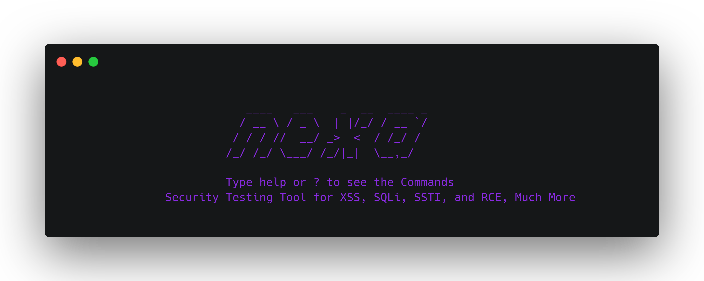

<br />
<p align="center">
  <a href="https://github.com/unf6/nexa">
    
  </a>

  
  

## 🔥 Unique Features

-   Developed Using Python 
-   Advanced Vulnerability Detection
-   Customizable
-   Payloads Based
-   User-friendly and Easy to Use

## 🚀 Installation from source

1. Clone the Lavamusic repository:

```bash
git clone https://github.com/unf6/nexa.git
```

2. Change to the Nexa directory:

```bash
cd Nexa
```

3. Install the required packages:

```bash
pip install -r requirements.txt
```

4. Run the tool:

```bash
python src/main.py
```

## 📜 Contributing

Thank you for your interest in contributing to Nexa! Here are some guidelines to follow when contributing:

1. Fork the repository and create a new branch for your feature or bug fix.
2. Write clean and concise code that follows the established coding style.
3. Create detailed and thorough documentation for any new features or changes.
4. Write and run tests for your code.
5. Submit a pull request with your changes.
